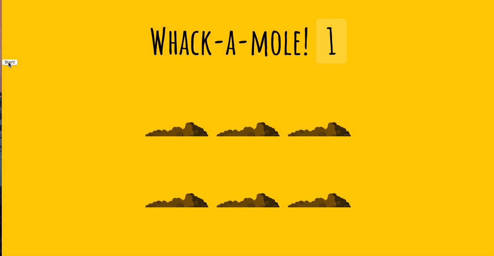

# WHACK-A-MOLE
This game is centered around moles and holes. The game was made using Html, JavaScript and CSS. The game is 10 seconds long. A mole comes out of every hole at random and stays at that hole for a random time between 20 milli seonds and 1 second.
Whenever a player uses their mouse to click on a mole, their score gets updated.This game can be further improved by creating expert levels to make the moles spend less time in each hole. While creating the game, I made it impossible for a mole to come out of a hole twice or more consecutively.

